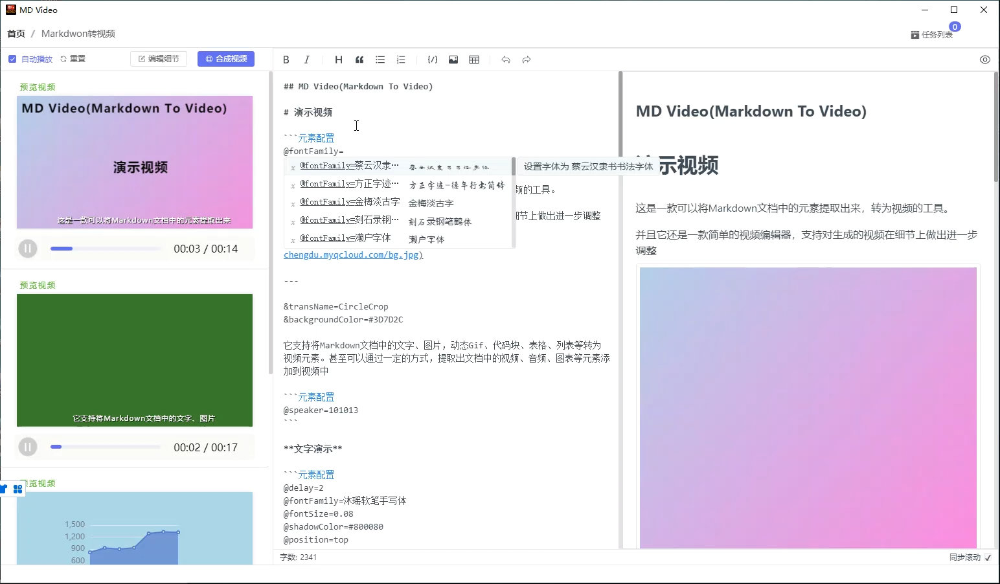
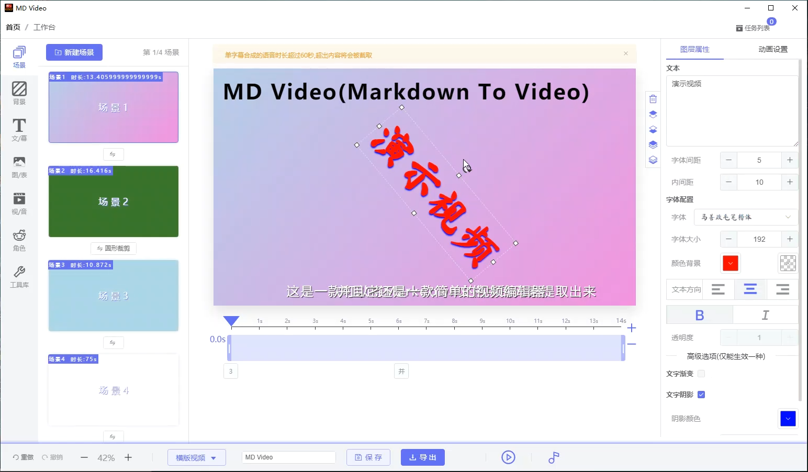
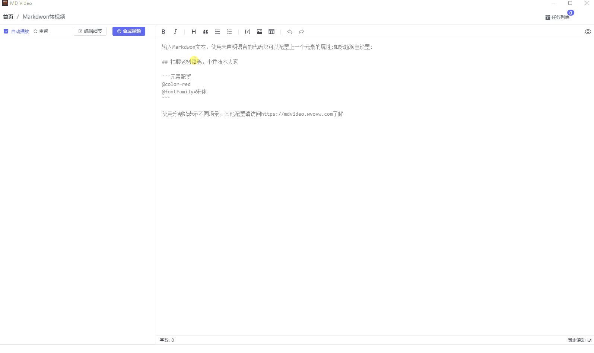

## 什么是 MD Video?


**MD Video**，是一个基于Electron开发的Window桌面应用，可以将 Markdown 文档转成为视频输出的编辑器，支持在编写文档时实时预览视频。

会自动提取文档里面的视频、音频、图片网址、标题、代码块、图表、列表等元素，抓取后插入生成视频，还可以根据文字生成人工语音的旁白朗读。

另外，MD Video还是一个视频编辑器，支持插入文字、图片、视频、音频、可视化图表等，并且支持各种动画效果。

参看详情：

[说明文档: https://www.wvovw.com](https://www.wvovw.com/)

[演示地址: https://www.wvovw.com/guide/what-is-wvovw.html](https://www.wvovw.com/guide/what-is-wvovw.html)

## 安装与运行


### 1. 安装 node-canvas 和 headless-gl 

软件合成视频是基于[ffcreator](https://github.com/tnfe/FFCreator) ,其依赖node-canvas 和 headless-gl，请先安装这两个依赖[node-canvas](https://github.com/Automattic/node-canvas)、[headless-gl](https://github.com/stackgl/headless-gl)。

### 2. 安装FFmpeg

在本项目resources文件下新建一个目录ffmpeg。

点击[此处](https://blog.gregzaal.com/how-to-install-ffmpeg-on-windows/)下载FFmpeg，解压后然后将ffmpeg.exe和ffprobe.exe放在上述目录下。

也可以将 `mdvideo/src/main/ffmpeg.ts`文件中的FFmpegPath和FFprobePath修改为自己的ffmpeg路径。

### 3. 下载与运行

```bash

git clone git@github.com:lqomg/mdvideo.git

cd mdvideo

npm install

// 重新构建本地原生模块库，否则无法正常运行
npm run rebuild 

npm run start

```

Note: 目前软件使用的语音合成服务是腾讯云的语音合成，如果需要请在`src/main/ipc/resource/voice/createTxVoice.ts`中填写你的密钥信息

## 注意事项

- 目前只支持 Windows 系统
- Node 版本请固定到 v14.18.0
- node-canvas的安装请参见[https://github.com/nodejs/node-gyp#on-windows](https://github.com/nodejs/node-gyp#on-windows)
- 由于node-canvas,headless-gl的限制,主要是这两个库都用了nan替代了n-api，所有在高版本的Electron下各种问题，参见[issues/2200](https://github.com/Automattic/node-canvas/issues/2200)。Electron版本请固定到 V7.3.3 


## 示例

### 基本操作



### 编辑器



### 演示 




  

