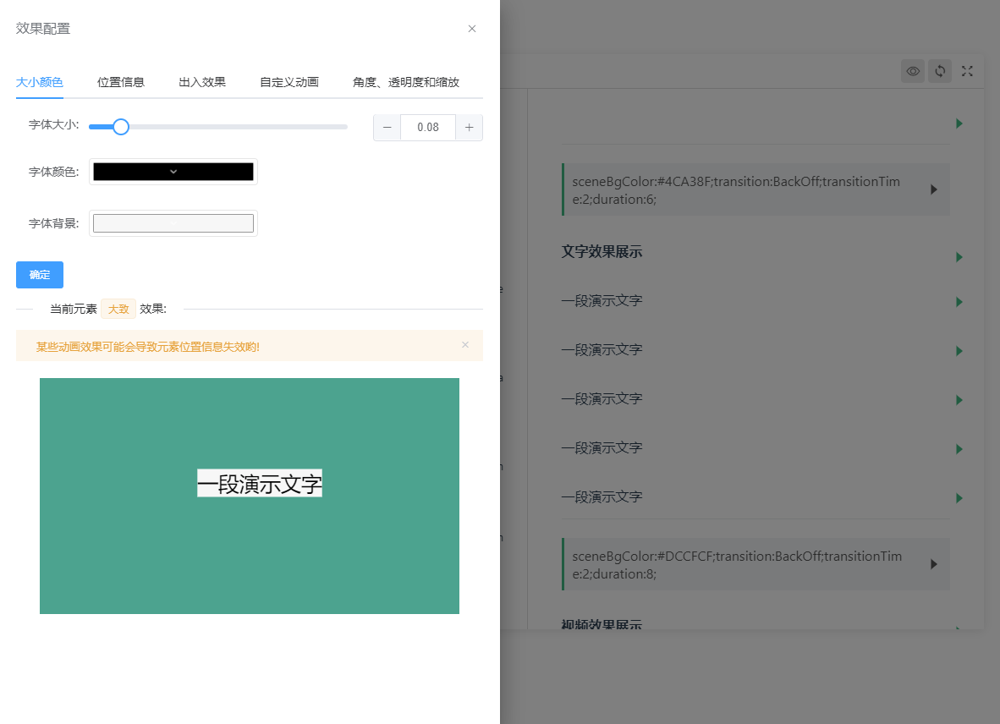
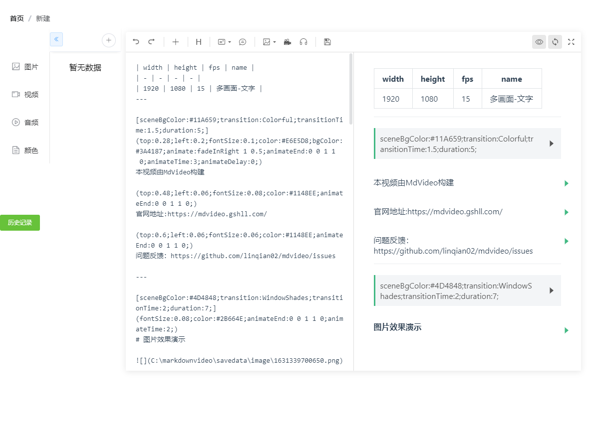

## 什么是 MDvideo?


> **MDvideo**，是一个桌面软件，自动将 Markdown 文档转成一段视频。
文档里面的视频、音频、图片网址，都会抓取后插入视频，还可以根据文字生成人工语音的旁白朗读。

<p align="center">
  
  
  
 
</p> 

## 特性

- [x] 📦 开箱即用，将注意力集中 markdown 文档编写和配置上
- [x] 🎥 `视频`、`音频`和`图片`等在线文件远程抓取，进行输入性剪辑
- [x] 🈵 方便快捷的`添加字幕`
- [x] 📋 支持自定义文字样式位置
- [x] 📡 支持`语音合成`的旁白，不用说话也可以生成有声视频（**需要配置**）
- [ ] 🎨 内置`多主题`，可为不同`行业`的视频制作人员提供`定制化模板`


> 具体使用参见：[https://mdvideo.gshll.com](https://mdvideo.gshll.com)


  
[点击查看一下文本的效果](https://mdvideo.gshll.com/images/mdvideo.mp4)


```html
| width | height | fps | name            | keep |
| ----- | ------ | --- | --------------- | ---- |
| 1920  | 1080   | 15  | mdVideo测试视频 | true |

---

# 居中的标题


一张淡出的图片加一段字幕，默认持续3秒钟

---

## 带背景的标题

`这是一段发音的字幕，默认持续时间为这段文字发音的时间`

---

(duration:5)

### 新闻标题


(width:0.5;left:0.1;top:0.2)


(type:text;textColor:red;fontSize:0.1;left:0.3;angle:14;underline:true;)
一张图片加贴图，配上一段特别的文字,持续5秒

---

@[2-12](http://vjs.zencdn.net/v/oceans.mp4)

这是一段持续10秒的视频剪辑

---

## 带背景的标题

&[10-25](https://www.cambridgeenglish.org/images/153149-movers-sample-listening-test-vol2.mp3)

`这是一段持续10秒的音频剪辑,加上一些也段的文字`

```

