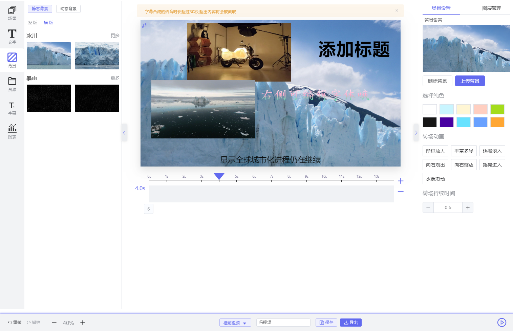
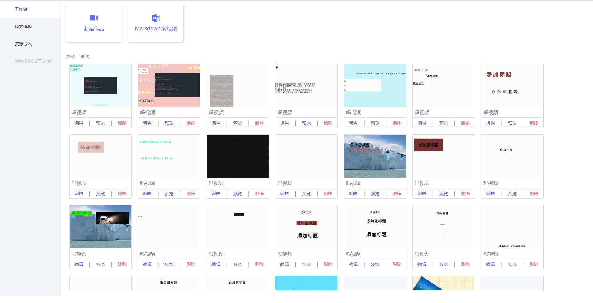
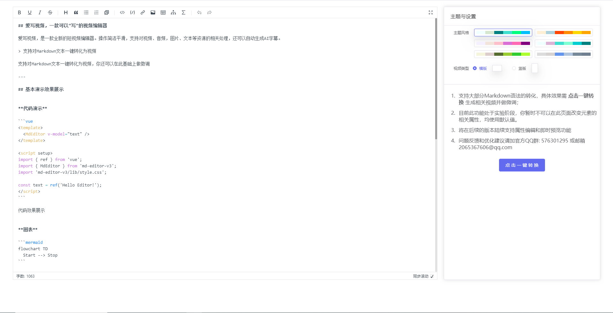
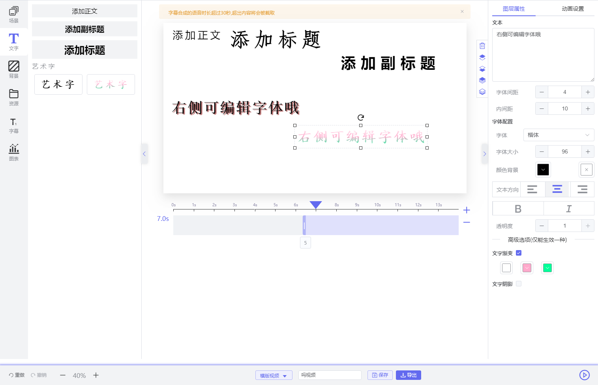
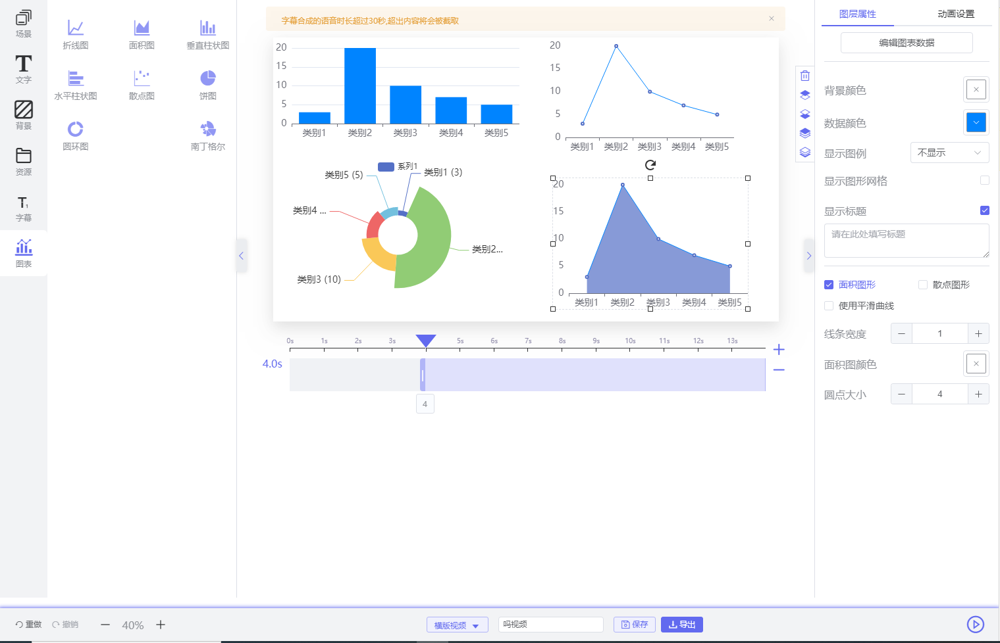
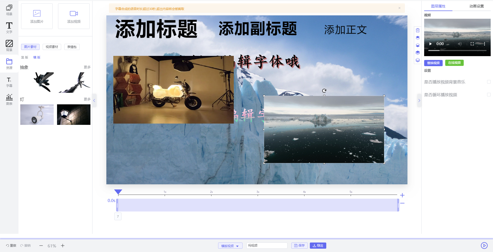
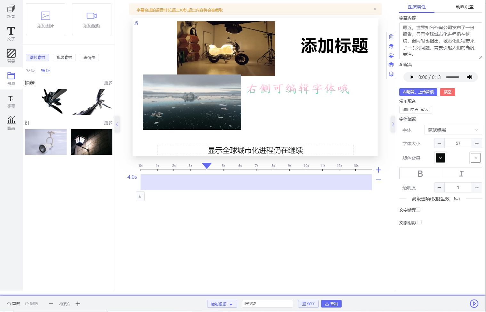
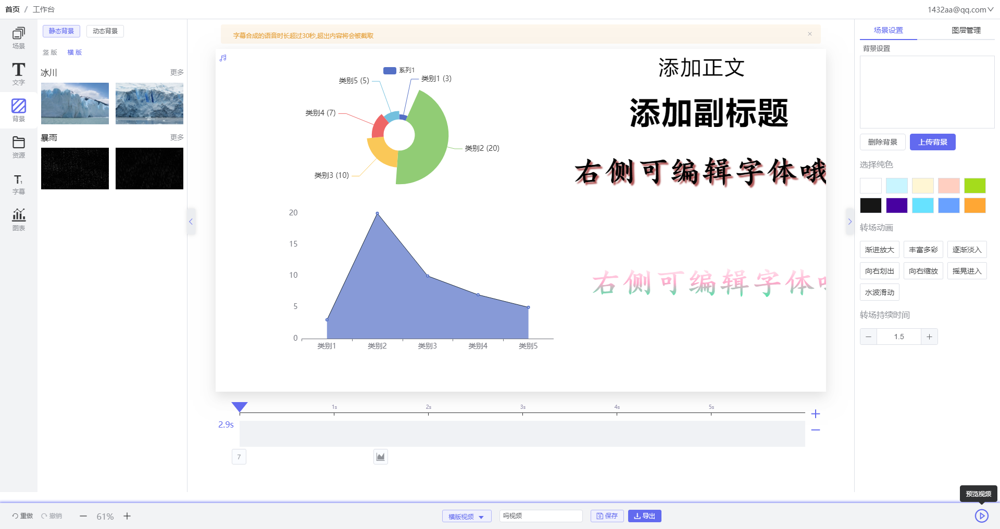

## 什么是 AX Video?

> **此版本暂时不维护，请进入一下链接 ，下载相关软件资源** ,
> [https://github.com/linqian02/axvideo/](https://github.com/lqomg/axvideo/)
 

> **AX Video 爱写视频**，是一个桌面软件，自动将 Markdown 文档转成一段视频的短视频编辑器，支持操作界面
文档里面的视频、音频、图片网址，都会抓取后插入视频，还可以根据文字生成人工语音的旁白朗读。

> 问题反馈请提issues 或者 , 进入QQ群 `576301295 ` 反馈。

  
  

 

  
  

 

  
  

 

  
  

 

  
  

 

  
  

 

  
  

 

  
  

 

  

