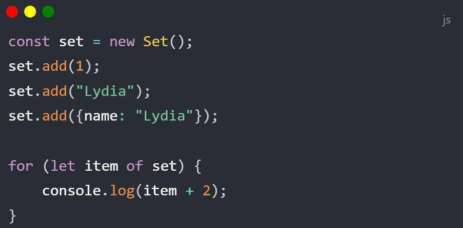

## 基础信息

### 帧/场景

<Alert>注意：当帧率 fps 过大时视频流程度会变高，但是会导致视频渲染较慢。
所以建议在`初始编辑视频，仅作看效果时`帧率 fps 设置为 15，当真实输出完整视频时设置为 60</Alert>

以`下划线`为分割插件，可以暂时理解`一段场景`。


### 配置信息

我们以 `{{}}` 中间的内容为当前场景的配置信息，配置信息仅仅应用于当前场景

当前场景就是指两个 `---`之间内容

例如

```markdown

{{duration:3 tt:Colorful }}

```

| 参数       | 含义     | 默认   | 其他                                                            |
| ---------- | -------- | ------ | --------------------------------------------------------------- |
| `duration` | 持续时间 | `3`    | 秒                                                              |
| `tt`       | 过度动画 | `无`   | 可选值：Fade Colorful WaterWave Stretch BackOff  Fat MoveLeft等 |
| `td`       | 持续时间 | `0.5`  | 秒                                                              |
| `bg`       | 背景色   | `#000` |


而`{}`之间的信息表示上面元素的配置信息；

元素配置对照表：

| 简写 | 全称     | 含义     | 默认 | 其他                                                                               |
| ---- | -------- | -------- | ---- | ---------------------------------------------------------------------------------- |
| w    | `width`  | 元素宽度 | 0.5  | 范围0-1,表示占比视频的多少，如800*600的视频，0.5表示宽度为视频宽度的50%，也就是400 |
| h    | `height` | 元素高度 | 0.5  | 范围0-1    |
| p    | `position` | 元素定位 | tl | 见 [position](/guide#position) |
| x    | `x` | 元素横向偏移量 | 0  | 范围0-1    |
| y    | `y` | 元素纵向偏移量  | 0  | 范围0-1    |
| o    | `offset` | 元素延迟出现的时间 | 0  | 单位秒   |
|d    | `duration` | 元素持续时间 | 3  | 范围0-1    |
| s    | `scale` | 元素放大缩小 | 0  |    |
| r    | `rotate` | 元素旋转角度| 0  | 0-360    |
| op    | `opacity` | 元素透明度 | 1  | 范围0-1    |
| f    | `fontSize` | 字体大小 | 0.01  | 范围0-1    |
|  c   | `color` | 字体颜色 | #fff  |     |
| b    | `backgroundColor` | 背景颜色 | #000  |    |


 
## 标题

添加标题,默认是居中状态的

```markdown

# 这是大标题

## 这是二级标题二

### 这是三级标题三三

#### 这是四级标题四四

##### 这是五级标题五五

```                                                                                                                      

## 文字

为视频添加一段文字信息，可配置文字大小、颜色、下划线、位置、旋转角度等等

例如

- (原图片地址)[https://cdn.beekka.com/blogimg/asset/202109/bg2021090117.jpg]

```markdown


这是个自定义的红色文本，字体大小为视频宽度的10%

{c:red f:0.1}

```


## 图片

以`淡出`的过渡方式添加一张全屏的图片

例如

- (原图片地址)[https://cdn.beekka.com/blogimg/asset/202109/bg2021090117.jpg]

```markdown


{w:1 h:1}

```


## 视频

MDVideo 最开始的初衷仅仅是为了更好的对视频进行编辑，如裁剪、添加字幕和贴图等

通过一下方式为你`自己视频`添加一个`视频片段`

例如

- (原视频地址)[http://vjs.zencdn.net/v/oceans.mp4]
```markdown

[video](http://vjs.zencdn.net/v/oceans.mp4)

{ss:0 to:10}

```


## 音频

添加一个音频片段

例如

- (原音频地址)[https://www.cambridgeenglish.org/images/153149-movers-sample-listening-test-vol2.mp3]

截取原音频的第 10 秒开始，到 20 秒结束

```markdown


[audio](https://www.cambridgeenglish.org/images/153149-movers-sample-listening-test-vol2.mp3)

{ss:10 to:20}

```


   
## 代码


Mdvideo会将如下代码转为图片，参数与图片一直

```js

const set = new Set();
set.add(1);
set.add("Lydia");
set.add({name: "Lydia"});

for (let item of set) {
    console.log(item + 2);
}
 ```
如下：
<p>

</p>

## 贴图

给视频添加一贴图或者水印表情的方式和添加图片一致，

只要配置参数的 width 或者 height 不等于`1`即可。

例如

- (原图片地址)[https://cdn.beekka.com/blogimg/asset/202109/bg2021090117.jpg]

```markdown


{w:0.5 h:0.5}

```


## 语音字幕

给视频添加一段普通字幕，可以配置字幕颜色和背景颜色


```markdown


`这是一段字幕，默认持续 3 秒钟`

```


