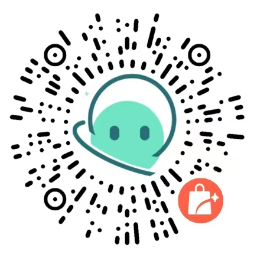

> 哇剪辑开发者自己整理了120GB(解压后120GB左右)的常用素材资源包，包括上百种字体、上万个语音/音频、GIF表情包、经典短视频片段、影视片段等等上10万文件。用户可以自己在阿里云盘下载

## 方式一：百度云盘

> 哇剪辑-素材资源包(wvovw)
> 
> https://pan.baidu.com/s/1SM3uSVx7l3xMaHUW-6Saig
> 
> 提取码: 6y4u

使用网盘的方式虽然免费，但网盘本身的网速限制，可能需要开通的网盘会员(30/月)才能下载成功...

所以软件提供第二种方式：
## 方式二: 下载码

此方式不限制下载速度，点击下方 **下载素材** 按钮输入下载码即可下载！

> 实际上大部分用户使用 3GB 左右的基础素材包即可。
> 购买送2万字符的AI语音合成额度，作为独立开发者，这是本软件唯一收费方式，谢谢各位支持！

::: info

购买地址请使用微信扫描一下二维码，**购买完成请联系客服获取下载码**：

:::

::: warning

确保你的电脑硬盘容量大于你购买的资源包大小，请务必使用桌面浏览器下载资源，可在浏览器的下载任务/内容查看下载进度！

:::

